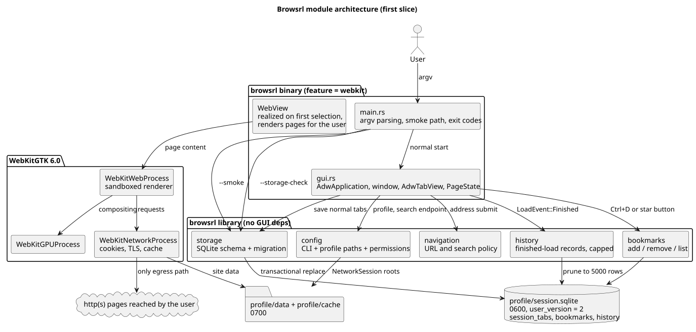
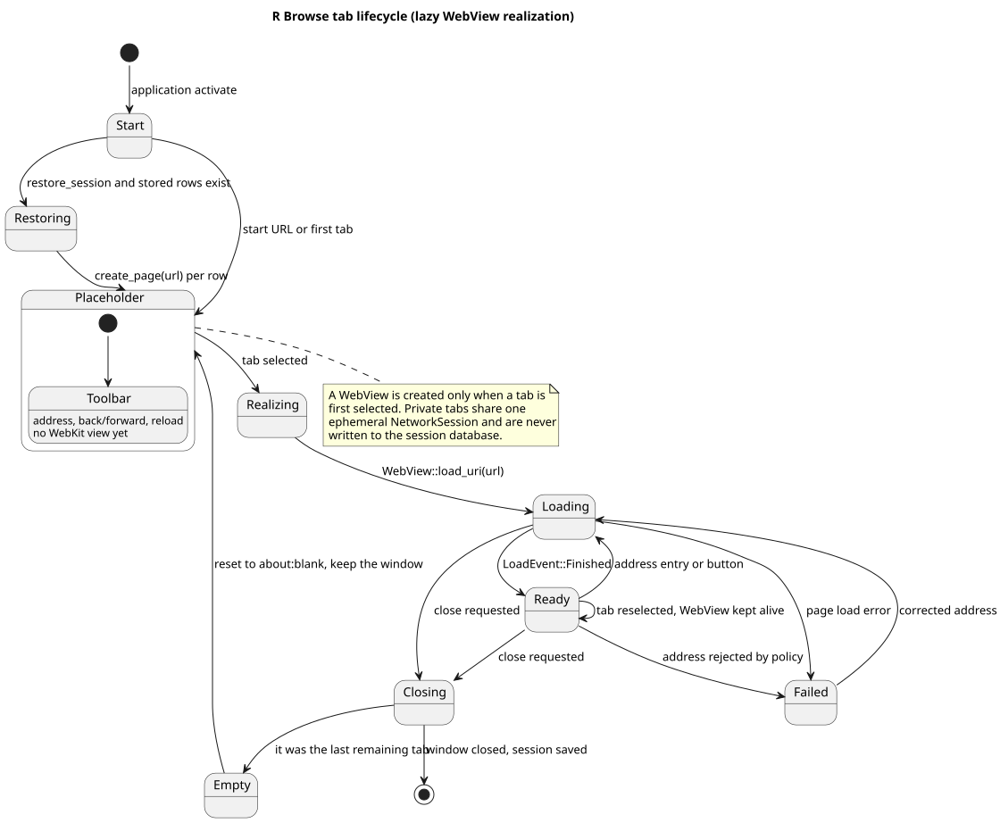
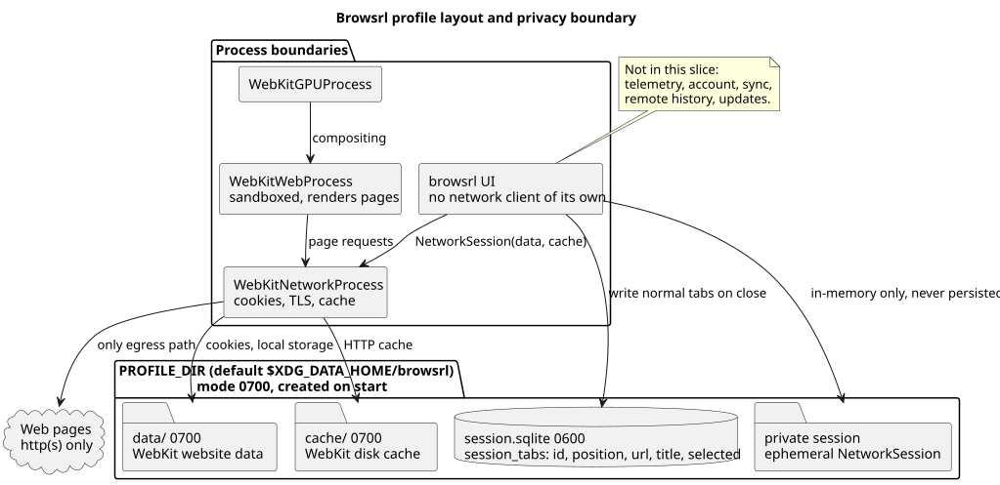

# R Browse

R Browse is an independent, local-first Linux browser shell written in Rust on
top of GTK4, libadwaita, and WebKitGTK 6.0. It is an independent
implementation in the spirit of the macOS browser
[driceroland/Search](https://github.com/driceroland/Search); no upstream code is
vendored here, and this repository does not claim feature parity with it.

This repository is a **first vertical slice**. What exists is a real window
with tabs, a strict navigation boundary, lazy WebView creation, private tabs,
and a local SQLite session record. Everything else is listed as deferred
below rather than stubbed out.

## Architecture







PNG fallbacks are committed next to the SVGs: [architecture](diagrams/architecture.png),
[tab lifecycle](diagrams/tab-lifecycle.png), and
[profile and privacy](diagrams/profile-and-privacy.png). The sources are
`diagrams/architecture.puml`, `diagrams/tab-lifecycle.puml`, and
`diagrams/profile-and-privacy.puml`.

### Source layout

| Path | Responsibility |
| --- | --- |
| `src/lib.rs` | Library root; no GUI dependencies. |
| `src/config.rs` | CLI parsing, exit codes, profile paths, `0700` directory hardening. |
| `src/navigation.rs` | The navigation policy: `http`, `https`, `about:blank`, and opt-in search. |
| `src/storage.rs` | Versioned SQLite `session_tabs` schema, migration, transactional save, `0600` hardening of the database and its `-wal`/`-shm` sidecars. |
| `src/main.rs` | Process entry: arguments, the `--smoke` path, exit codes. |
| `src/gui.rs` | `AdwApplication`, window, tab strip, `PageState`, the window's `WebContext`, and lazy `WebView` realization. |

The library half is deliberately free of GTK and WebKit so it can be checked
head-less (`make check-core`) and exercised by the end-to-end contract without a
display. `gui.rs` holds a `Browser` bundle (context, normal and private network
sessions, search endpoint) that every tab shares, so per-tab state stays in
`PageState`.

### How a tab works

1. `gui.rs` creates an `AdwTabPage` holding a toolbar and a placeholder label.
   No WebKit object exists yet.
2. When the page is selected, `realize_page` creates a `WebView` bound to the
   tab's `WebKitNetworkSession` and starts the pending load.
3. `LoadEvent::Finished` copies the final URI and title into the address entry
   and the tab label.
4. Closing the window writes the normal tabs to SQLite in one transaction.
   Private tabs are filtered out and are never restored. The session is written
   when a tab closes and when the window closes, so a `SIGKILL` or a crash loses
   whatever changed since the last of those.

## Requirements and build

The default feature needs GTK4, libadwaita 1.x, WebKitGTK 6.0 (the `webkit6`
feature targets WebKit 2.52), SQLite, `pkg-config`, and a C toolchain. Rust is
pinned by `rust-toolchain.toml`.

```sh
make doctor    # toolchain and library versions
make build
make run
```

`WEBKIT_PREFIX` defaults to the portable system prefix `/usr` and is used for
both `pkg-config` and `LD_LIBRARY_PATH`, so a relocated prefix stays local to
one command:

```sh
WEBKIT_PREFIX=/path/to/prefix/usr make doctor
WEBKIT_PREFIX=/path/to/prefix/usr make build
WEBKIT_PREFIX=/path/to/prefix/usr make run
```

The relocated prefix needs `lib/pkgconfig/webkitgtk-6.0.pc` plus the matching
headers, libraries, and WebKit helper processes. The WebKit sandbox is never
disabled and there is no flag that turns it off.

## Command line

```
Usage: rbrowse [--profile-dir PATH] [--database-path PATH] [--data-dir PATH]
               [--cache-dir PATH] [--start-url URL] [--search-endpoint URL]
               [--no-restore] [--smoke]
```

| Flag | Meaning |
| --- | --- |
| `--profile-dir` | Profile root; defaults to `$XDG_DATA_HOME/rbrowse`. |
| `--database-path`, `--data-dir`, `--cache-dir` | Override individual paths inside the profile. |
| `--start-url` | URL for the first tab; defaults to `about:blank`. |
| `--search-endpoint` | Enables `search:` queries. Without it, search text is rejected instead of being sent anywhere. Must be `https`, except for a loopback host such as a local SearxNG. |
| `--no-restore` | Ignore stored tabs and start from `--start-url`. |
| `--smoke` | Head-less contract path: validate the URL, write one session row, read it back, print JSON. |

Exit codes: `0` for success and for `--help`/`--version`, `1` for a failed
startup or smoke check, `2` for a malformed invocation.

R Browse is single-instance: a second launch becomes a tab in the first window,
so two processes never write the same profile. If a session database is held by
another process anyway, startup fails with an explicit message rather than a
bare SQLite error.

### Navigation policy

`navigation.rs` is the only place a URL is accepted, and it is deliberately
small: `http`, `https`, and `about:blank`. A bare host such as `example.com`
becomes `https://example.com/`; `file:`, `javascript:`, `data:`, and other
`about:` pages are rejected with a message instead of being silently rewritten.
Search is opt-in: without `--search-endpoint`, `search:` input is refused, so
the shell can never become an accidental search relay to a third party.

## Profile and session data

The profile holds `session.sqlite` (`0600`) plus `data/` and `cache/`
directories (`0700`), and every one of them is created or re-hardened at
startup. SQLite's `-wal` and `-shm` sidecars carry the same URLs and titles as
the database and are created with the process umask, so they are re-hardened to
`0600` as well. Cookies and site data stay inside WebKit's own storage under
`data/`. Nothing is written outside the profile directory, and no global GTK,
desktop, or OpenCode configuration is touched.

## Verification

```sh
make verify     # fmt, clippy, head-less core check, build, e2e, diagram check
```

| Target | What it proves |
| --- | --- |
| `make fmt-check` | `cargo fmt` is clean. |
| `make clippy` | No clippy warnings with `-D warnings`. |
| `make check-core` | The library half compiles without GTK or WebKit. |
| `make build` | The real binary links. |
| `make e2e` | The offline contract below, writing `artifacts/e2e/report.json`. |
| `make perf` | Five smoke runs, writing `artifacts/perf.json`. |
| `make diagrams-check` | Every committed SVG/PNG matches a fresh render. |

`make e2e` runs the built binary against loopback fixtures from `tests/fixtures`
and asserts observable behaviour: SQLite round-trip, session restore, rejection
of non-web and look-alike input (`file:`, `javascript:`, `data:`, `HTTP://`,
`//host`, `about:config`) against their exact messages, bare-host normalization,
search requiring an explicit endpoint, the `https`-only endpoint policy, the CLI
exit-code contract, and permission hardening that starts from a deliberately
world-readable profile. It needs no Internet access.

The permission check is mutation-tested: with the hardening disabled it fails on
`session.sqlite` remaining `0666` while every other check still passes, so it is
not a check that passes by construction.

### Manual GUI verification

The window and live WebKit rendering are verified by hand on a real session,
not by the automated contract. Serve a fixture and start the browser:

```sh
make build
(cd tests/fixtures && python3 -m http.server 8123 --bind 127.0.0.1 &)
./target/debug/rbrowse --profile-dir "$(mktemp -d)" \
    --start-url http://127.0.0.1:8123/one.html
```

Expected: one `Tab 1`, the address entry showing the requested URL, the fixture
body rendered by WebKit, and `data/` populated with WebKit's own storage. This
is how the two-tab and blank-address regressions seen during development were
found, so it is worth repeating after tab-strip changes.

**Not covered by automation:** the GUI. `WebKitWebDriver` is installed and works
against WebKit's own MiniBrowser, but it cannot drive this shell yet:
WebKitGTK 6.0 requires the app to answer
`WebKitAutomationSession::create-web-view` and return a view created with
`is-controlled-by-automation`, and the `webkit6` 0.6.1 bindings (the current
release) do not expose that detailed signal. Rather than ship a fragile
hand-written closure around it, the slice leaves GUI automation out and says so.
The profile, storage, navigation, and CLI layers are covered by the contract
above.

## Privacy and current boundaries

* WebKit owns page rendering, website data, cookies, and caching.
* A private tab runs on `NetworkSession::new_ephemeral()`. In WebKitGTK 6.0 the
  website-data manager belongs to the network session, so that session's
  manager reports `is_ephemeral() == true` and has no data directory at all:
  private cookies and site data stay in memory, are never written under
  `data/`, and are not shared with the normal session. It is not a claim of
  isolation from the operating system or the network itself.
* The session database stores tab URLs and titles only. It is not a browsing
  history, and it records nothing from a private tab.
* There is no telemetry, account, sync, remote history, or update client in this
  slice, and no code path that would add one. The shell opens no sockets of its
  own: every request goes through the WebKit network process.
* Wayland is preferred by the native GTK stack, with the GTK X11 fallback.

Deliberately deferred: bookmarks, browsing history, downloads, reader mode,
passwords (Secret Service is not wired yet), extensions, DRM playback,
packaging, desktop integration, keyboard shortcuts, and update management.
WebKitGTK 2.52 exposes only part of the WebExtensions surface, so extension
work is gated on the API actually present rather than emulated.

## PlantUML assets

```sh
PLANTUML_JAR=/path/to/plantuml.jar make diagrams
PLANTUML_JAR=/path/to/plantuml.jar make diagrams-check
```

The sources use `!pragma layout smetana`, so rendering needs only PlantUML
itself and no Graphviz installation. `check-diagrams.sh` renders every
`diagrams/*.puml` into a temporary directory, compares each committed SVG and
PNG byte for byte, and fails if an asset is stale or missing. Regenerate with
`make diagrams` after editing a source. The committed assets were rendered with
PlantUML 1.2024.7, so a different PlantUML release can legitimately produce
different bytes; re-render in that case.
